# Claude Skills - Operator Testing Framework

This directory contains Claude skills for automated PyTorch operator precision testing on NPU/GPU devices.

## 🚀 Quick Start

```
/test-op path/to/your_operator.py
```

This single command orchestrates the entire testing workflow.

---

## Skills Overview

| Skill | Command | Purpose |
|-------|---------|---------|
| **test-op** | `/test-op` | Main entry point - orchestrates the full workflow |
| **analyze-operator** | `/analyze-operator` | Step 1: Analyze operator structure |
| **plan-operator-test** | `/plan-operator-test` | Step 2: Generate test configurations |
| **execute-operator-test** | `/execute-operator-test` | Step 3: Run tests & export results |

---

## Workflow

```mermaid
flowchart LR
    A["/test-op"] --> B["1️⃣ Analyze"]
    B --> C{User Confirms?}
    C -->|Yes| D["2️⃣ Plan"]
    C -->|No| B
    D --> E{User Approves?}
    E -->|Yes| F["3️⃣ Execute"]
    E -->|No| D
    F --> G["📊 Results + CSV"]
```



### Phase Details

| Phase | Skill | Output | User Action |
|-------|-------|--------|-------------|
| **Analyze** | `analyze-operator` | Analysis report (parameters, types, structure) | Confirm accuracy |
| **Plan** | `plan-operator-test` | Test plan (shapes, dtypes, tolerances) | Approve plan |
| **Execute** | `execute-operator-test` | Test results + CSV export | Review results |

---

## Input File Format

Your operator file should contain:

```python
# CPU reference implementation
def operator_cpu(input: torch.Tensor, **kwargs) -> torch.Tensor:
    # Pure Python/PyTorch implementation
    ...

# NPU/GPU implementation to test
def operator_npu(input: torch.Tensor, **kwargs) -> torch.Tensor:
    # Accelerator implementation (torch_npu, cuda, etc.)
    ...
```

---

## Outputs

- **Analysis Report** - Markdown with parameter classification
- **Test Plan** - Markdown with test configurations
- **Test Results** - Markdown summary + CSV export

### CSV Format
```csv
test_id,shape,dtype,pattern,status,max_abs_diff,max_rel_diff,mse,error
1,"(1,3,32,32)",torch.float32,random,PASS,1.2e-7,3.4e-6,1.1e-14,
```

---

## Tolerance Reference

| Operator Type | float32 | float16 | bfloat16 |
|--------------|---------|---------|----------|
| Elementwise | 1e-5 | 1e-3 | 1e-2 |
| Reduction | 1e-4 | 1e-3 | 1e-2 |
| MatMul | 1e-4 | 1e-3 | 1e-2 |
| Normalization | 1e-3 | 1e-2 | 5e-2 |
| Attention | 1e-3 | 1e-2 | 5e-2 |

---

## Directory Structure

```
.claude/skills/
├── README.md                    # This file
├── test-op/
│   └── SKILL.md                 # Main orchestrator
├── analyze-operator/
│   └── SKILL.md                 # Phase 1: Analysis
├── plan-operator-test/
│   └── SKILL.md                 # Phase 2: Test planning
└── execute-operator-test/
    └── SKILL.md                 # Phase 3: Execution
```
